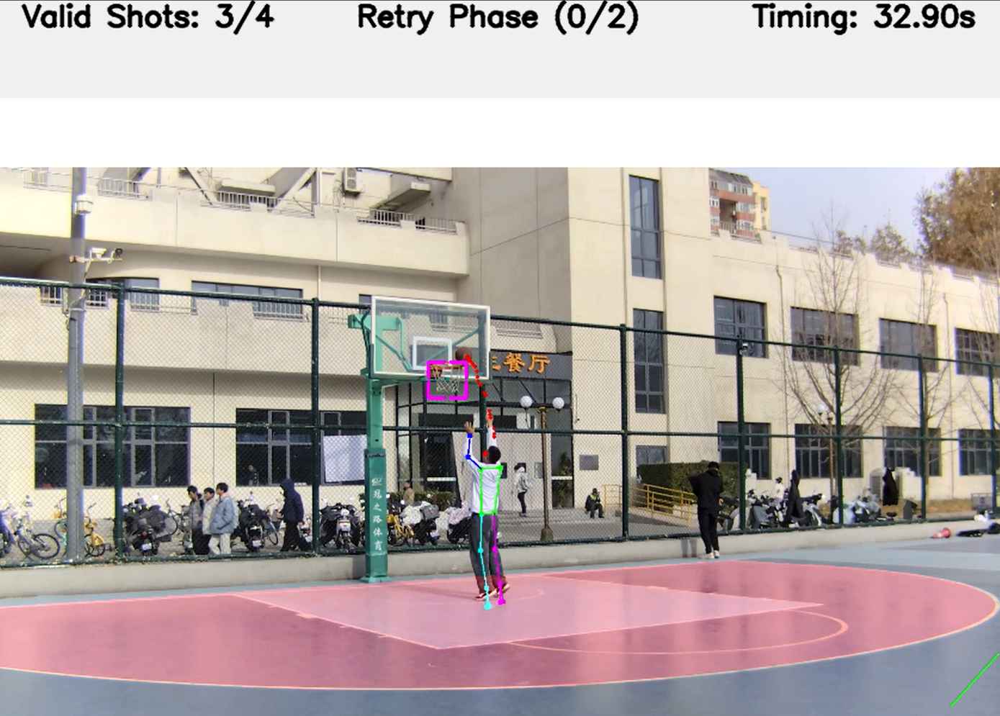

# Basketball Layup Test System



A computer-vision pipeline for basketball layup-style exams: it detects the ball and player pose with **YOLO (Ultralytics)**, tracks shot events, applies court geometry (start/end lines and three-point regions), and scores the attempt using a **state machine** driven workflow. The application supports **offline video files**, **live camera**, and **RTSP** inputs.

---

## Features

- **Ball and pose detection** using separate YOLO models (`Basketball.pt`, `Pose.pt`).
- **Court calibration** via interactive markers for start/end lines and three-point arc polygons (saved as JSON under `configs/`).
- **Multiple input modes**: file path, webcam index, or `--rtsp_url`.
- **Batch / integration mode** via `--json` and result files under `configs/results/`.
- **Annotated video output** written under `outputs/` (see runtime logs for the exact path).
- **Event timeline** compatible with downstream scoring (events can be merged into result JSON in JSON mode).

---

## Requirements

- **Python** 3.10+ recommended (3.8+ may work depending on dependency wheels).
- **PyTorch** with CUDA (optional but recommended for real-time performance).
- **OpenCV** (`cv2`).
- **Ultralytics** (`ultralytics` — YOLOv8-style API).

A concrete pinned dependency file is not shipped in this repository; install the stack in a virtual environment and align **PyTorch + CUDA** builds with your GPU driver (see the [PyTorch install guide](https://pytorch.org/get-started/locally/)).

---

## Installation

```bash
git clone https://github.com/<your-username>/Basketball_Layup_Test_System.git
cd Basketball_Layup_Test_System

python -m venv .venv
# Windows
.venv\Scripts\activate
# Linux / macOS
# source .venv/bin/activate

pip install torch torchvision  # install the CUDA build appropriate for your system
pip install ultralytics opencv-python
```

---

## Model weights

Place the following files in the `weights/` directory before running:

| File            | Purpose              |
|-----------------|----------------------|
| `Basketball.pt` | Ball detection       |
| `Pose.pt`       | Human pose detection |

These files are **not** distributed with this repository (large binaries). Train or export your own models, or add them locally after clone. The repository tracks `weights/.gitkeep` so the folder exists in a fresh checkout.

---

## Project layout

```
.
├── main.py                 # CLI entry point
├── detectors/              # YOLO-based detectors and orchestration
├── utils/                  # I/O, markers, state machine, device helpers
├── configs/
│   ├── start_end_lines/    # Start / end line JSON
│   ├── three_point_areas/  # Three-point region JSON
│   └── results/            # Per-run JSON configs and updated scores
├── inputs/                  # Local videos (ignored by git; use .gitkeep)
├── outputs/                 # Rendered videos (ignored by git)
└── weights/                 # *.pt models (ignored by git)
```

At runtime, `main.py` creates `configs/results/` when needed. The directories `configs/start_end_lines/`, `configs/three_point_areas/`, and `configs/results/` (plus `generate_tree.py` and `project_structure.txt`) are **omitted from git** via `.gitignore`; populate them locally with your own JSON or by using the in-app marking workflow.

---

## Usage

### Interactive mode

Run without positional arguments to select the video source interactively:

```bash
python main.py
```

### Video file with explicit court configs

```bash
python main.py <video_path> [start_end_lines.json] [three_point.json] <fps> <gender>
```

Example:

```bash
python main.py inputs/example.mp4 configs/start_end_lines/court_a_start_end_lines.json configs/three_point_areas/court_a_three_point.json 60 M
```

- **`fps`**: used for time-based scoring when metadata is unreliable or overridden.
- **`gender`**: `M` or `F` (passed through to scoring logic).

Omitted line configs fall back to filenames derived from the **video basename**, or trigger on-screen marking when empty.

### JSON-driven run

```bash
python main.py --json <name_without_extension>
```

This reads `configs/results/<name>.json`, resolves `fileName`, `courtName`, and `frameRate`, loads the video from `inputs/`, and updates the same JSON with `totalScore` and `events` when the exam completes.

### Optional flags

| Flag | Description |
|------|-------------|
| `--resolution N` | Square YOLO inference size (default: `1280`). Lower if GPU memory is tight. |
| `--game_id ID` | Identifier used where messaging hooks are wired (reserved for integrations). |
| `--rtsp_url URL` | RTSP stream URL when not using positional `video_path`. |

---

## GPU memory and stability

The entry point sets several CUDA-related environment variables and performs a coarse memory check when CUDA is selected. If you hit **CUDA out of memory**, try:

1. `--resolution 640` or `--resolution 320`
2. Closing other GPU processes
3. Forcing CPU: `set CUDA_VISIBLE_DEVICES=-1` (Windows) or `export CUDA_VISIBLE_DEVICES=-1` (Unix)

---

## Documentation

Additional notes for integrators and data formats live under `docs/` (for example, backend JSON conventions).

---

## Contributing

Issues and pull requests are welcome. Please keep changes scoped and consistent with existing module boundaries (`detectors/` vs `utils/`).
